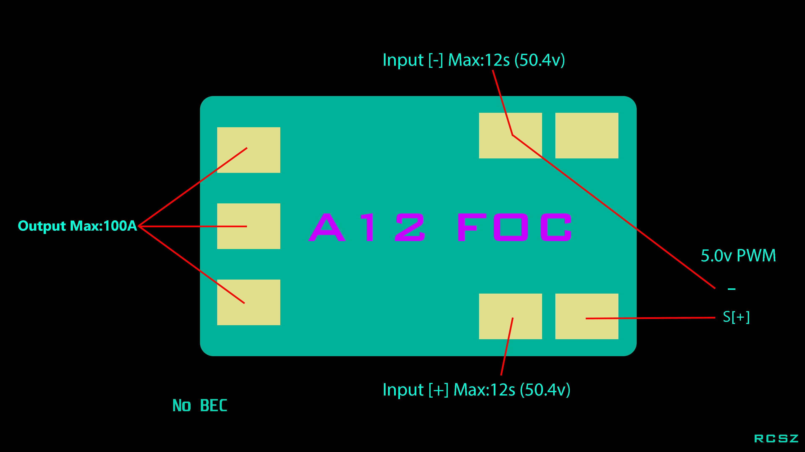
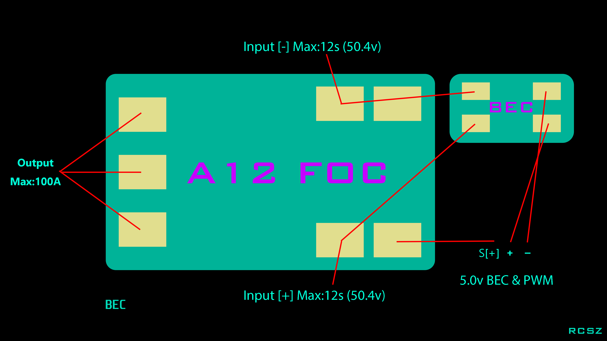
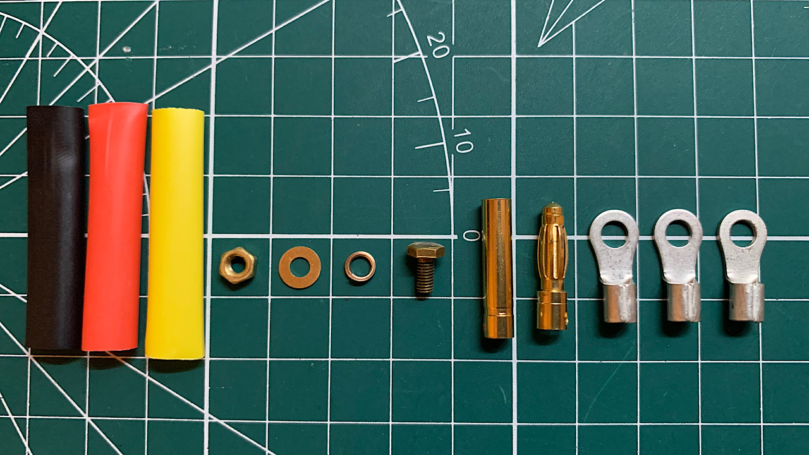
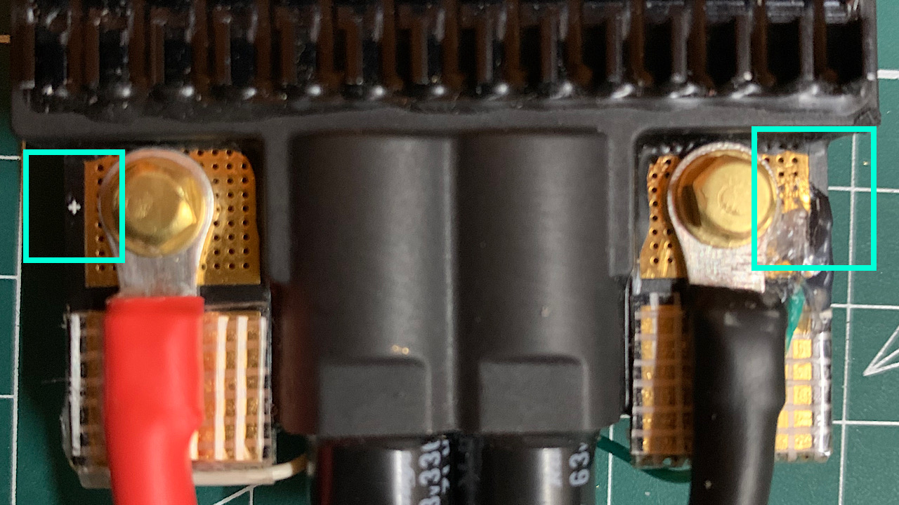
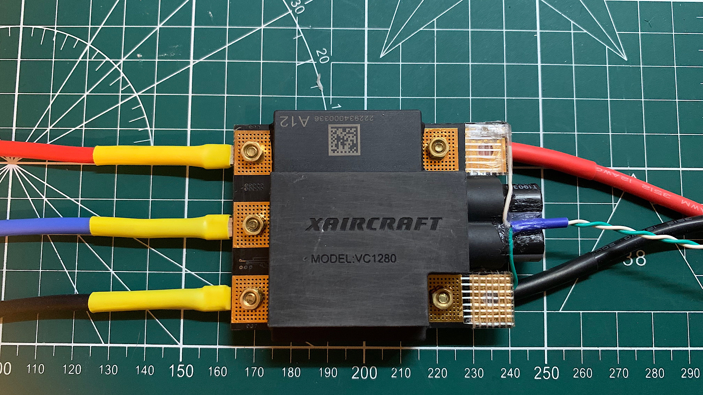
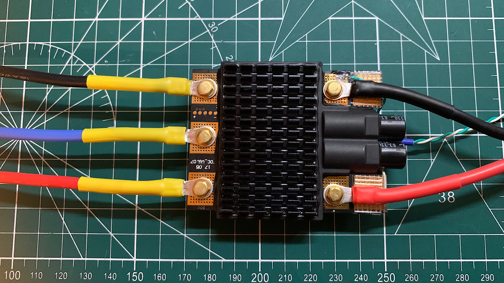
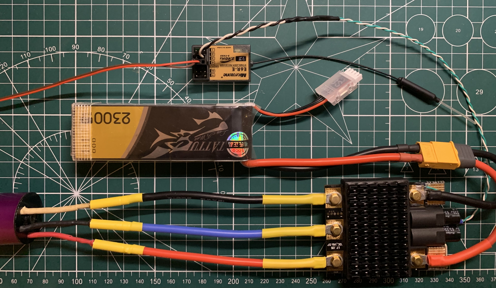

# Modified-XAG-A12-ESC
改装 XAG-A12 电调

目前极飞A12电调(极飞2018产品?)非常便宜某海鲜市场只需要50, 完全可以改成航模电调, 但是只能用于低kv电机?(我测试1200kv的时候直接烧了一个), 还是进角问题？

### 目前我了解到 A12 ESC 的一些参数

- 输入电压 2-13s (8.4v~54.6v)
- 最大持续电流 100A
- 理论最大功率 5000w+ (但是A12电机实际只有2500w)
- 实际上这是有感电调但是由于没有找到相关文档只有先不管
- 无 BEC 输出 (毕竟原厂是接在极飞动力板上的)
- 适配电机 A12 100kv

### 无感接线图 不带BEC & 带BEC

    
    

### 改为航模标准接线

- 12AWG 200°C 软硅胶线(红,黑,蓝)
- 3mm*6mm 纯铜六角螺丝
- OT3.5-4 紫铜镀锌压线鼻头
- AMASS XT60-H 
- 4mm 镀金香蕉头

    
    

### 改完测试

- 有条件的一定先拿示波器看一下频率波形
- 我也不确定它的驱动频率进角等, 如果有A12电机就完美适配
- 当玩具谨慎使用

    
    

